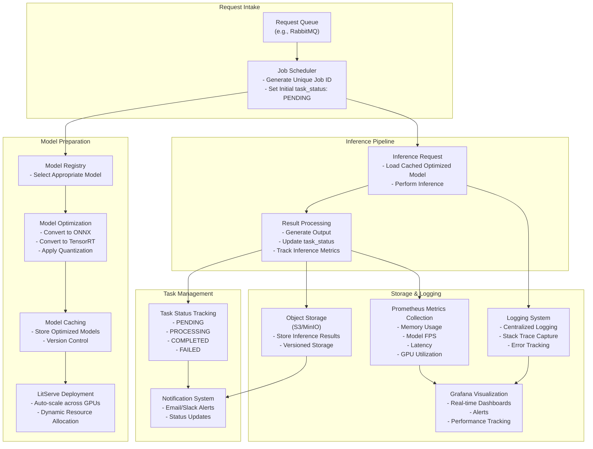

# Video Super Resolution Enhancer API 

&nbsp;

<strong>Transform your videos with state-of-the-art AI upscaling.</strong>    
Easy. Powerful. Enterprise-grade.    

----

**Video Super Resolution Enhancer API** is a cutting-edge solution to upscale, restore, and enhance videos using AI models. It offers flexibility and performance, ensuring seamless integration for developers and enterprises.  

This API provides at least [2x better performance](#performance) compared to traditional methods with features like GPU autoscaling and noise reduction.    

  
<pre>
✅ 2x and 4x Upscaling        ✅ Real-time Monitoring      
✅ Noise Reduction            ✅ Model Flexibility
✅ GPU Auto-scaling           ✅ Sharpening & Artifact Removal
</pre>

----

## Architecture for the AI Upscaling Pipeline

----

### Proposed Stack

- **RabbitMQ**: Robust message queue for handling requests.
- **Prometheus + Grafana**: Self-hosted monitoring and visualization for metrics such as GPU utilization and latency.
- **Litserve**: Model inference serving with GPU autoscaling, batching, and streaming.
- **GitHub Actions**: CI/CD pipelines for seamless deployment and testing.
- **Docker**: Containerization for scalability and ease of deployment.
- **Loguru**: Centralized logging with stack trace capture and error tracking.
- **Model Package**: Repository containing inference code for supported models.
- **AWS S3 or Serverless Providers**: For storing inference results with version control.

----

