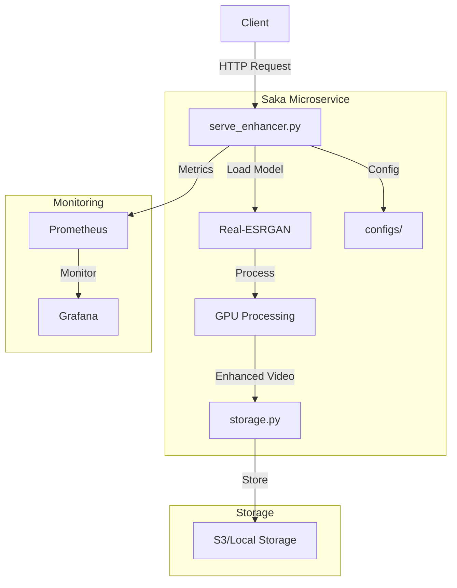

<h1>Saka</h1>
<h3>A Modern AI-Powered Video Enhancement Microservice</h3>

    
    
    
    

<h2>&#127760; Overview</h2>

Saka is a high-performance video enhancement platform that leverages state-of-the-art AI models to upscale and improve video quality. Built with scalability and performance in mind, it offers both API and CLI interfaces for seamless integration into existing workflows.

<h2>&#10024; Key Features</h2>

<table>
    <tr>
        <th align="center">Category</th>
        <th align="center">Features</th>
    </tr>
    <tr>
        <td align="center"><strong>Enhancement Capabilities</strong></td>
        <td align="center">
            &#8226; 2x/4x Video Upscaling 
            &#8226; Anime-Optimized Processing 
            &#8226; Artifact Removal 
            &#8226; Face Enhancement
        </td>
    </tr>
    <tr>
        <td align="center"><strong>Performance</strong></td>
        <td align="center">
            &#8226; GPU Auto-Scaling 
            &#8226; Dynamic Batch Processing 
            &#8226; Asynchronous Operations 
            &#8226; Multi-GPU Support
        </td>
    </tr>
    <tr>
        <td align="center"><strong>Infrastructure</strong></td>
        <td align="center">
            &#8226; S3-Compatible Storage 
            &#8226; Real-time Monitoring 
            &#8226; Docker Support 
            &#8226; Quality Metrics (SSIM)
        </td>
    </tr>
</table>

<h2>&#127969; System Architecture</h2>

<h2>&#128640; Getting Started</h2>

<h3>Prerequisites</h3>

<ul>
    <li>NVIDIA GPU with CUDA 11.8+</li>
    <li>Docker 20.10+ (for containerized deployment)</li>
    <li>Python 3.10+</li>
    <li>16GB+ RAM recommended</li>
</ul>

<h3>Installation</h3>

<ol>
    <li>
        <strong>Clone the Repository</strong>
        <pre><code>git clone --recursive https://github.com/vikramxD/saka.git
cd saka</code></pre>
    </li>
    <li>
        <strong>Set Up Python Environment</strong>
        <pre><code>python -m venv venv
source venv/bin/activate  # On Windows: .\venv\Scripts\activate
pip install -r requirements.txt</code></pre>
    </li>
    <li>
        <strong>Configure Environment</strong>
        <pre><code>cp .env.example .env
# Edit .env with your configuration</code></pre>
    </li>
</ol>

<h3>Docker Deployment</h3>

<ol>
    <li>
        <strong>Build and Run with Docker Compose</strong>
        <pre><code>docker-compose up -d</code></pre>
    </li>
    <li>
        <strong>Check Service Status</strong>
        <pre><code>docker-compose ps</code></pre>
    </li>
</ol>

<h2>&#128187; Usage</h2>

<h3>API Interface</h3>

<pre><code>from saka.client import VideoEnhancerClient

# Initialize client
client = VideoEnhancerClient()

# Enhance video
result = client.enhance_video(
    input_path="input.mp4",
    upscale_factor=2,
    calculate_ssim=True
)

print(f"Enhanced video available at: {result['output_url']}")</code></pre>

<h3>CLI Interface</h3>

<pre><code># Basic enhancement
saka enhance video.mp4 --output enhanced.mp4

# Advanced options
saka enhance video.mp4 --scale 4 --quality high --model anime</code></pre>

<h2>&#128206; Configuration</h2>

<h3>Core Settings (<code>configs/settings.py</code>)</h3>

<pre><code>class Settings(BaseSettings):
    realesrgan: UpscalerSettings = UpscalerSettings()
    api: APISettings = APISettings()
    s3: S3Settings = S3Settings()</code></pre>

<h3>Available Environment Variables</h3>

<table>
    <tr>
        <th align="center">Variable</th>
        <th align="center">Description</th>
        <th align="center">Default</th>
    </tr>
    <tr>
        <td align="center"><code>SAKA_MODEL_PATH</code></td>
        <td align="center">Path to model weights</td>
        <td align="center"><code>./models</code></td>
    </tr>
    <tr>
        <td align="center"><code>SAKA_GPU_IDS</code></td>
        <td align="center">GPUs to use (comma-separated)</td>
        <td align="center"><code>0</code></td>
    </tr>
    <tr>
        <td align="center"><code>SAKA_BATCH_SIZE</code></td>
        <td align="center">Processing batch size</td>
        <td align="center"><code>4</code></td>
    </tr>
    <tr>
        <td align="center"><code>SAKA_API_PORT</code></td>
        <td align="center">API server port</td>
        <td align="center"><code>8000</code></td>
    </tr>
</table>

<h2>&#128202; Monitoring</h2>

<h3>Metrics Dashboard</h3>

Access the Grafana dashboard at <code>http://localhost:3000</code> with default credentials:

<ul>
    <li>Username: <code>admin</code></li>
    <li>Password: <code>admin</code></li>
</ul>

<h3>Key Metrics</h3>

<ul>
    <li>GPU Utilization</li>
    <li>Processing Latency</li>
    <li>Memory Usage</li>
    <li>Batch Processing Efficiency</li>
    <li>SSIM Quality Scores</li>
</ul>

<h3>Setup Monitoring Stack</h3>

<pre><code>./scripts/setup_monitoring.sh</code></pre>

<h2>&#128193; Project Structure</h2>

<pre><code>saka/
&#9472;&#9472; api/                 # API implementation
&#9472;&#9472;     &#9472; client.py       # Client library
&#9472;&#9472;     &#9472; serve.py        # API server
&#9472;&#9472;     &#9472; storage.py      # Storage handlers
&#9472;&#9472; configs/            # Configuration
&#9472;&#9472;     &#9472; settings.py     # Core settings
&#9472;&#9472;     &#9472; models.py       # Model configs
&#9472;&#9472; models/             # Model implementations
&#9472;&#9472; scripts/            # Utility scripts
&#9472;&#9472; tests/              # Test suite
&#9472;&#9472; docker/             # Docker configurations</code></pre>

<h2>&#128220; Contributing</h2>

<ol>
    <li>Fork the repository</li>
    <li>Create your feature branch (<code>git checkout -b feature/amazing-feature</code>)</li>
    <li>Commit your changes (<code>git commit -m 'Add amazing feature'</code>)</li>
    <li>Push to the branch (<code>git push origin feature/amazing-feature</code>)</li>
    <li>Open a Pull Request</li>
</ol>

<h2>&#128214; License</h2>

This project is licensed under the MIT License - see the <a href="LICENSE">LICENSE</a> file for details.

<h2>&#128578; Acknowledgments</h2>

<strong>Made with &#10084; by VikramxD</strong>

    <a href="https://saka-docs.example.com">Documentation</a> &#8226;
    <a href="https://github.com/vikramxD/saka/issues">Issues</a> &#8226;
    <a href="CONTRIBUTING.md">Contributing</a>

