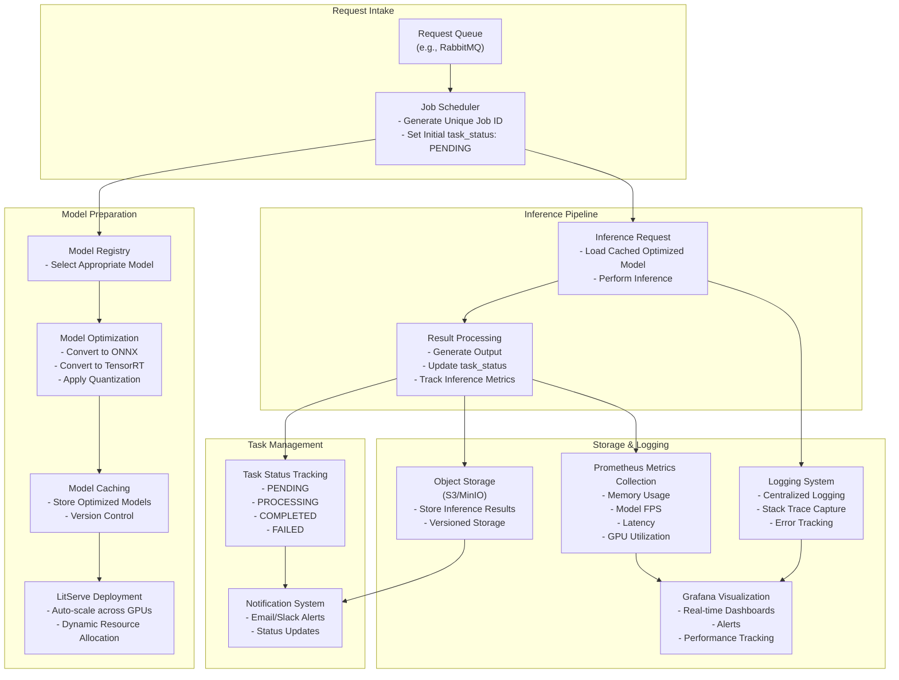

<div align='center'>

# Video Super Resolution Enhancer API 


&nbsp;

<strong>Transform your videos with state-of-the-art AI upscaling.</strong>    
</div>

----

**Video Super Resolution Enhancer API** is a cutting-edge solution to upscale, restore, and enhance videos using AI models.
<div align='center'>
  
<pre>
✅ 2x and 4x Upscaling        ✅ Real-time Monitoring      
✅ Noise Reduction            ✅ Model Flexibility
✅ GPU Auto-scaling           ✅ Sharpening & Artifact Removal
</pre>

</div>

----

## Architecture for the AI Upscaling Pipeline


----

### Stack

- **ZeroMQ**: Robust message queue for handling requests.
- **Prometheus + Grafana**: Self-hosted monitoring and visualization for metrics such as GPU utilization and latency.
- **Litserve**: Model inference serving with GPU autoscaling, batching, and streaming.
- **GitHub Actions**: CI/CD pipelines for seamless deployment and testing.
- **Docker**: Containerization for scalability and ease of deployment.
- **Loguru**: Centralized logging with stack trace capture and error tracking.
- **Model Package**: Repository containing inference code for supported models.
- **AWS S3 or Serverless Providers**: For storing inference results with version control.

----

## 🚀 Quick Start

### Prerequisites

- Python 3.10 or higher
- CUDA-compatible GPU (recommended)
- FFmpeg installed on your system

### Installation

1. Clone the repository with submodules:
```bash
git clone --recursive https://github.com/vikramxD/video-enhancer.git
cd video-enhancer
```

2. Install dependencies:
```bash
pip install -r requirements.txt
```

3. Configure S3 settings:
   - Copy `.env.example` to `.env`
   - Update the following S3 configuration in `.env`:
     ```env
     S3_ACCESS_KEY=your_access_key
     S3_SECRET_KEY=your_secret_key
     S3_REGION=your_region
     S3_BUCKET_NAME=your_bucket_name
     S3_ENDPOINT_URL=your_endpoint_url  # Optional: for custom S3 providers
     ```

4. Set up the monitoring stack:
```bash
# Make the setup script executable
chmod +x setup_monitoring.sh

# Run the setup script
./setup_monitoring.sh

# Start the monitoring stack
./monitoring/start_monitoring.sh
```

The monitoring stack will be available at:
- Prometheus: http://localhost:9090
- Grafana: http://localhost:3000 (default login: admin/admin)

----

### Monitoring with Prometheus and Grafana

The project includes a comprehensive monitoring stack with Prometheus and Grafana for real-time metrics visualization:

1. **Metrics Collected**:
   - GPU Utilization
   - Memory Usage
   - Model Inference FPS
   - Request Latency
   - Queue Size
   - Error Rates

2. **Grafana Dashboards**:
   - Pre-configured dashboard for video enhancement metrics
   - Real-time performance monitoring
   - Resource utilization graphs
   - Error tracking and alerts

3. **Setup and Management**:
   - Use `start_monitoring.sh` to start both Prometheus and Grafana
   - Services are configured to start on the following ports:
     - Prometheus: 9090
     - Grafana: 3000

4. **Custom Metrics**:
   - Prometheus endpoint exposed at `/metrics`
   - Custom metrics for video processing status
   - Batch processing performance metrics
   - GPU memory allocation tracking

----

## 💡 Usage

### API Endpoints

- `POST /enhance`: Submit a video for enhancement
- `GET /status/{job_id}`: Check job status
- `GET /result/{job_id}`: Download enhanced video

### Example Usage

```python
import requests

# Submit a video for enhancement
with open('input.mp4', 'rb') as f:
    response = requests.post('http://localhost:8000/predict',
                           files={'video': f},
                           data={'scale': 2,
                                 'model': 'real-esrgan'})
job_id = response.json()['job_id']

# Check status
status = requests.get(f'http://localhost:8000/status/{job_id}').json()
print(f"Job Status: {status['status']}")

# Download result when complete
if status['status'] == 'COMPLETED':
    result = requests.get(f'http://localhost:8000/result/{job_id}')
    with open('enhanced.mp4', 'wb') as f:
        f.write(result.content)
```

## 🛠️ Development

### Local Development Setup

1. Create a virtual environment:
```bash
python -m venv venv
source venv/bin/activate  # Linux/macOS
```

### Docker Setup

To run the application using Docker, you can use the provided Dockerfile and docker-compose.yml:

1. Build and run the Docker container:
   ```bash
   docker-compose up --build
   ```

2. Access the API at `http://localhost:8000` and Prometheus at `http://localhost:9090`.

### Dependencies

The project requires the following key dependencies:
- **AI and Machine Learning**: `torch`, `gfpgan`, `basicsr`, etc.
- **Video Processing**: `ffmpeg-python`, `opencv-python`.
- **Web Frameworks**: `fastapi`, `httpx`.
- **Monitoring and Logging**: `prometheus-client`, `loguru`.

### Monitoring with Prometheus and Grafana

The application includes monitoring capabilities using Prometheus and Grafana:
- Prometheus is configured to collect metrics from the API.
- Grafana can be accessed at `http://localhost:3000` for visualizing metrics.

## 🔧 Troubleshooting

### Common Issues

1. **GPU Out of Memory**
   - Reduce batch size in config
   - Lower video resolution
   - Use CPU fallback mode

2. **Slow Processing**
   - Check GPU utilization
   - Verify CUDA installation
   - Monitor system resources

3. **Failed Jobs**
   - Check logs in Grafana
   - Verify input video format
   - Ensure sufficient storage


## 📊 Metrics & Monitoring

Key metrics tracked:
- GPU Utilization
- Processing Time
- Queue Length
- Error Rates
- Model Performance

## API Information

### API Endpoints

- `POST /predict`: Enhance a video

### Request Format

```json
{
    "video_base64": "<base64 encoded video data>",
    "calculate_ssim": true
}
```

### Response Format

```json
{
    "output_url": "https://storage.example.com/videos/uuid/enhanced.mp4",
    "metrics": {
        "ram_usage_mb": 1024.5,
        "processing_time_sec": 15.3,
        "ssim_score": 0.95
    }
}
```

### Configuration

Key settings in `configs/settings.py`:

```python
class S3Settings:
    bucket_name: str  # S3 bucket for storing enhanced videos
    access_key: str   # S3 access key
    secret_key: str   # S3 secret key
    endpoint_url: str # Optional custom S3 endpoint
    region: str       # S3 region

class RealESRGANSettings:
    model_path: str   # Path to model weights
    device: str       # cuda or cpu
    tile_size: int    # Tile size for processing
    batch_size: int   # Batch size for inference
```

### Error Handling

Common error responses:
- `400 Bad Request`: Invalid input (e.g., no video file, invalid base64)
- `413 Payload Too Large`: Video file too large
- `500 Internal Server Error`: Processing failed
