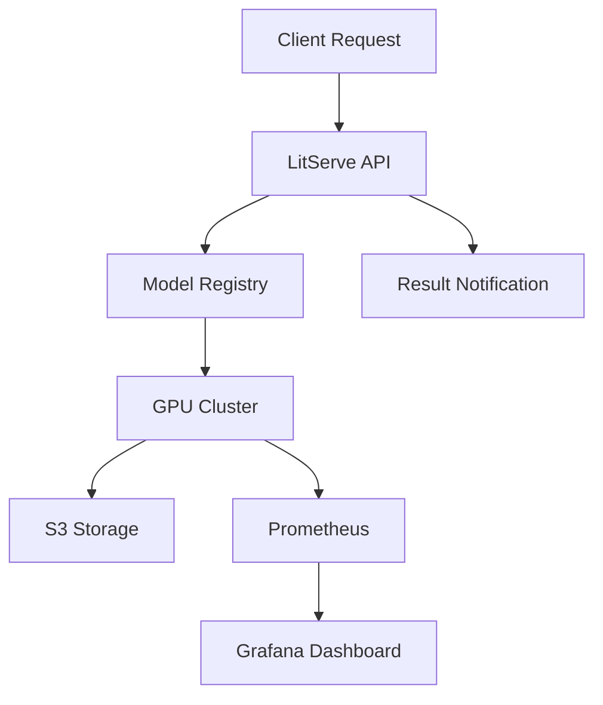

<div align='center'>

# Saka
### A Modern AI-Powered Video Enhancement Microservice


[](https://www.python.org/downloads/)
[](https://developer.nvidia.com/cuda-toolkit)
[](https://www.docker.com/)
[](LICENSE)

</div>

## 📋 Overview

Saka is a high-performance video enhancement platform that leverages state-of-the-art AI models to upscale and improve video quality. Built with scalability and performance in mind, it offers both API and CLI interfaces for seamless integration into existing workflows.

## ✨ Key Features

| Category | Features |
|----------|----------|
| **Enhancement Capabilities** | • 2x/4x Video Upscaling<br>• Anime-Optimized Processing<br>• Artifact Removal<br>• Face Enhancement |
| **Performance** | • GPU Auto-Scaling<br>• Dynamic Batch Processing<br>• Asynchronous Operations<br>• Multi-GPU Support |
| **Infrastructure** | • S3-Compatible Storage<br>• Real-time Monitoring<br>• Docker Support<br>• Quality Metrics (SSIM) |

## 🏗 System Architecture



## 🚀 Getting Started

### Prerequisites

- NVIDIA GPU with CUDA 11.8+
- Docker 20.10+ (for containerized deployment)
- Python 3.10+
- 16GB+ RAM recommended

### Installation

1. **Clone the Repository**
   ```bash
   git clone --recursive https://github.com/vikramxD/saka.git
   cd saka
   ```

2. **Set Up Python Environment**
   ```bash
   python -m venv venv
   source venv/bin/activate  # On Windows: .\venv\Scripts\activate
   pip install -r requirements.txt
   ```

3. **Configure Environment**
   ```bash
   cp .env.example .env
   # Edit .env with your configuration
   ```

### Docker Deployment

1. **Build and Run with Docker Compose**
   ```bash
   docker-compose up -d
   ```

2. **Check Service Status**
   ```bash
   docker-compose ps
   ```

## 💻 Usage

### API Interface

```python
from saka.client import VideoEnhancerClient

# Initialize client
client = VideoEnhancerClient()

# Enhance video
result = client.enhance_video(
    input_path="input.mp4",
    upscale_factor=2,
    calculate_ssim=True
)

print(f"Enhanced video available at: {result['output_url']}")
```

### CLI Interface

```bash
# Basic enhancement
saka enhance video.mp4 --output enhanced.mp4

# Advanced options
saka enhance video.mp4 --scale 4 --quality high --model anime
```

## 🔧 Configuration

### Core Settings (`configs/settings.py`)

```python
class Settings(BaseSettings):
    realesrgan: UpscalerSettings = UpscalerSettings()
    api: APISettings = APISettings()
    s3: S3Settings = S3Settings()
```

### Available Environment Variables

| Variable | Description | Default |
|----------|-------------|---------|
| `SAKA_MODEL_PATH` | Path to model weights | `./models` |
| `SAKA_GPU_IDS` | GPUs to use (comma-separated) | `0` |
| `SAKA_BATCH_SIZE` | Processing batch size | `4` |
| `SAKA_API_PORT` | API server port | `8000` |

## 📊 Monitoring

### Metrics Dashboard

Access the Grafana dashboard at `http://localhost:3000` with default credentials:
- Username: `admin`
- Password: `admin`

### Key Metrics

- GPU Utilization
- Processing Latency
- Memory Usage
- Batch Processing Efficiency
- SSIM Quality Scores

### Setup Monitoring Stack

```bash
./scripts/setup_monitoring.sh
```

## 📁 Project Structure

```
saka/
├── api/                 # API implementation
│   ├── client.py       # Client library
│   ├── serve.py        # API server
│   └── storage.py      # Storage handlers
├── configs/            # Configuration
│   ├── settings.py     # Core settings
│   └── models.py       # Model configs
├── models/             # Model implementations
├── scripts/            # Utility scripts
├── tests/              # Test suite
└── docker/             # Docker configurations
```

## 🤝 Contributing

1. Fork the repository
2. Create your feature branch (`git checkout -b feature/amazing-feature`)
3. Commit your changes (`git commit -m 'Add amazing feature'`)
4. Push to the branch (`git push origin feature/amazing-feature`)
5. Open a Pull Request

## 📝 License

This project is licensed under the MIT License - see the [LICENSE](LICENSE) file for details.

## 🙏 Acknowledgments

- Real-ESRGAN for the base upscaling models
- LitServe team for the serving framework
- The open-source community

---

<div align="center">

**Made with ❤️ by VikramxD**

[Documentation](https://saka-docs.example.com) •
[Issues](https://github.com/vikramxD/saka/issues) •
[Contributing](CONTRIBUTING.md)

</div>
